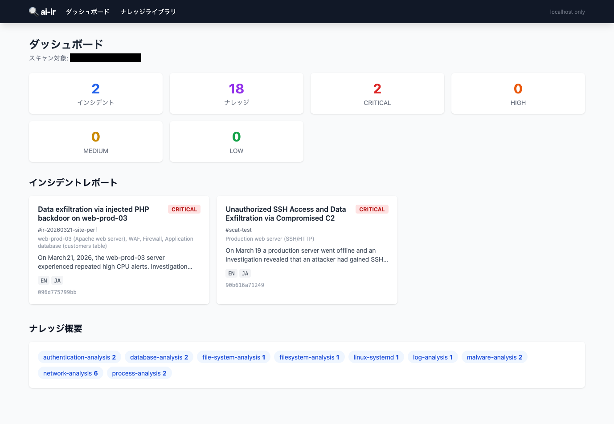
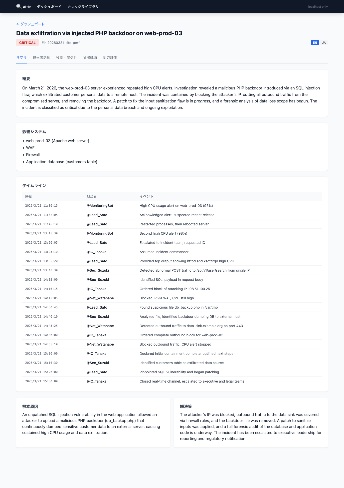
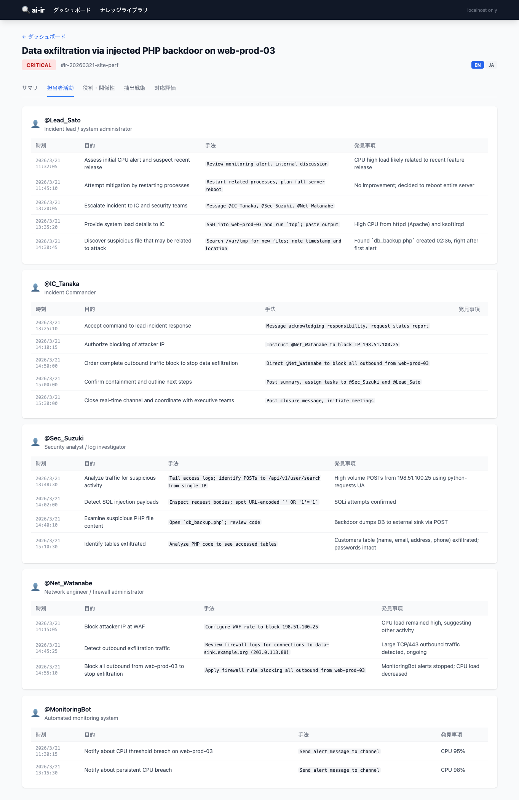
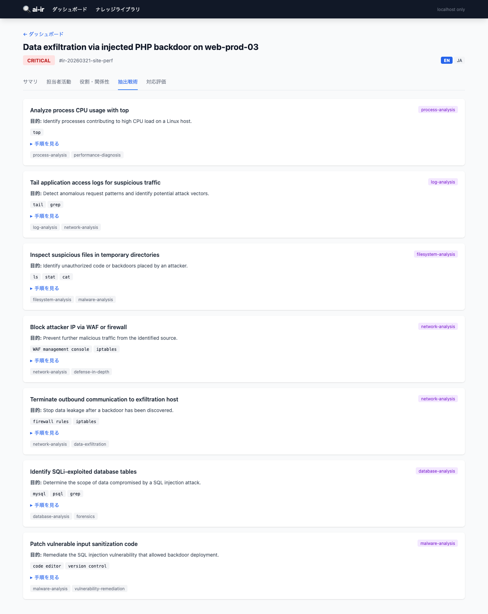
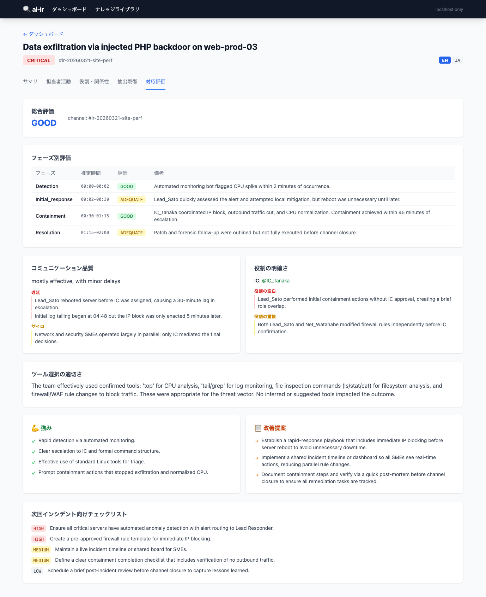

# ai-ir: AI駆動インシデントレスポンス解析ツールセット

[English](README.md)

`ai-ir` は [scat](https://github.com/magifd2/scat) または [stail](https://github.com/magifd2/stail) でエクスポートした
インシデントレスポンス Slack 会話履歴を解析し、実用的なレポートと再利用可能なナレッジを生成します。

## 機能

- **インシデントサマリ** — AI生成のタイムライン、根本原因、エグゼクティブサマリ
- **活動分析** — 参加者ごとの手法・ツール・発見事項の詳細分析
- **役割推定** — IRロール（インシデントコマンダー、SMEなど）と関係性の推定
- **ナレッジ抽出** — 再利用可能な調査戦術をYAMLドキュメントとして抽出; RAGインジェスト用Markdownへのエクスポート
- **対応評価** — IRプロセス品質の評価（フェーズタイミング、コミュニケーション、役割の明確さ、改善チェックリスト）
- **翻訳** — 技術コンテンツを保持しながらレポートJSONを他言語に翻訳
- **ローカルWeb UI** — `aiir serve` で解析結果をブラウズ（読み取り専用、localhost限定）
- **セキュリティファースト** — IoC無害化とプロンプトインジェクション防御を内蔵

## インストール

Python 3.11以上と [uv](https://docs.astral.sh/uv/) が必要です。

```bash
git clone https://github.com/magifd2/ai-ir
cd ai-ir
uv sync
```

## 設定

`.env.example` を `.env` にコピーし、LLMエンドポイントを設定します：

```bash
cp .env.example .env
# .env を編集して設定を記入
```

```bash
AIIR_LLM_BASE_URL=https://api.openai.com/v1
AIIR_LLM_API_KEY=sk-...
AIIR_LLM_MODEL=gpt-4o
```

`.env` ファイルを使わず、環境変数を直接設定することもできます。

## 使い方

### Slackチャンネル履歴のエクスポート

```bash
# stail を使う場合
stail export -c "#incident-response" --output incident.json

# scat を使う場合
scat export log --channel "#incident-response" --output incident.json
```

### Step 1: インジェストと前処理

エクスポートを解析し、IoC を無害化し、プロンプトインジェクションリスクを検出します：

```bash
uv run aiir ingest incident.json -o incident.preprocessed.json
```

デフォルトでは標準出力に出力されます（パイプ対応）：

```bash
uv run aiir ingest incident.json | uv run aiir summarize -
```

### Step 2: 解析の実行

各コマンドは生のエクスポートファイルまたは前処理済みファイルを受け付けます：

```bash
# インシデントサマリを生成（Markdown）
uv run aiir summarize incident.json

# インシデントサマリを生成（JSON）
uv run aiir summarize incident.json --format json -o summary.json

# 参加者ごとの活動を分析
uv run aiir activity incident.json -o activity.md

# 参加者の役割と関係性を推定
uv run aiir roles incident.json -o roles.md

# フルレポート（JSON）を生成し、戦術をYAMLナレッジドキュメントとして同時保存
uv run aiir report incident.json --format json -o report.json -k ./knowledge/

# フルレポート（Markdown）を生成
uv run aiir report incident.json -o report.md

# 戦術のみ抽出（フルレポートなし）
uv run aiir report incident.json --knowledge-only -k ./knowledge/
```

### フルパイプライン例

```bash
# 一度前処理し、すべての解析を実行
uv run aiir ingest incident.json -o preprocessed.json

uv run aiir summarize preprocessed.json -o summary.md
uv run aiir activity preprocessed.json -o activity.md
uv run aiir roles preprocessed.json -o roles.md

# フルレポート + ナレッジドキュメントを一括生成
uv run aiir report preprocessed.json --format json -o report.json -k ./knowledge/
```

### Step 3: レポートの翻訳（オプション）

解析は精度最大化のため常に英語で実行されます。`aiir translate` でレポートJSONのローカライズ版を生成します。
ツール名、コマンド、IoC、ID、タグなどの技術コンテンツは英語のまま保持されます。

```bash
# 日本語に翻訳 — report.ja.json を report.json と同じ場所に保存
uv run aiir translate report.json --lang ja

# サポートされている言語コード: ja, zh, ko, de, fr, es
# 上記以外の言語はBCP-47コードで指定可能
uv run aiir translate report.json --lang zh -o report.zh.json
```

### Step 4: 対応プロセスのレビュー（オプション）

レポート生成後、チームの対応品質を評価します。フェーズタイミング、コミュニケーション品質、
役割の明確さ、具体的な改善提案を出力します：

```bash
# report.review.json を report.json と同じ場所に保存
uv run aiir review report.json

# 共有用にMarkdown形式で出力
uv run aiir review report.json --format markdown -o review.md
```

`report.review.json` が存在する場合、Web UI に **対応評価** タブが自動表示されます。

### RAG用Markdownへの戦術エクスポート（オプション）

戦術YAMLファイルをRAGナレッジベースへのインジェスト用に個別Markdownドキュメントへ変換します。
1ファイル1戦術とすることで検索精度が向上します。

```bash
# ./knowledge 内の戦術YAMLをすべて ./knowledge-md にMarkdown変換
uv run aiir knowledge export -k ./knowledge -o ./knowledge-md
```

### Web UIで結果を確認

レポートとナレッジドキュメントを生成後、ローカルWeb UIを起動します：

```bash
# カレントディレクトリを対象に起動（レポートJSONと戦術YAMLを再帰的にスキャン）
uv run aiir serve

# 特定ディレクトリをカスタムポートで起動
uv run aiir serve ./output --port 9000

# ブラウザを自動で開かずに起動
uv run aiir serve --no-browser
```

サーバーは `127.0.0.1` のみにバインドされ、読み取り専用です。ブラウザで http://localhost:8765 を開いてダッシュボードを表示します。

### Web UIスクリーンショット

<table>
<tr>
<td><br><sub>ダッシュボード — インシデント一覧とナレッジ概要</sub></td>
<td><br><sub>サマリタブ — タイムライン・根本原因・解決策</sub></td>
</tr>
<tr>
<td><br><sub>担当者活動タブ — 参加者ごとのアクションと発見事項</sub></td>
<td><br><sub>役割・関係性タブ — 推定役割とチームの関係性</sub></td>
</tr>
<tr>
<td><br><sub>抽出戦術タブ — 会話から抽出した再利用可能な調査戦術</sub></td>
<td><br><sub>対応評価タブ — IRプロセス品質評価と改善チェックリスト</sub></td>
</tr>
</table>

## セキュリティ

- **外部送信なし**: 設定したLLMエンドポイントのみにデータを送信
- **IoC無害化**: IPv4アドレス、URL、ドメイン、メールアドレス、ハッシュをLLM送信前に無害化
- **プロンプトインジェクション防御**: すべてのSlackメッセージテキストをXMLタグで囲み、インジェクションパターンをスキャン
- **ローカル処理**: すべての解析と前処理はローカルで実行

詳細は [docs/ja/security.md](docs/ja/security.md) を参照してください。

## ドキュメント

- [アーキテクチャ](docs/ja/architecture.md) / [Architecture](docs/en/architecture.md)
- [データフォーマット](docs/ja/data-format.md) / [Data Format](docs/en/data-format.md)
- [ナレッジフォーマット](docs/ja/knowledge-format.md) / [Knowledge Format](docs/en/knowledge-format.md)
- [セキュリティ](docs/ja/security.md) / [Security](docs/en/security.md)
- [メンテナンス](docs/ja/maintenance.md) / [Maintenance](docs/en/maintenance.md)

## 開発

```bash
# 開発依存関係込みでインストール
uv sync

# テスト実行
uv run pytest tests/ -v

# カバレッジ付きでテスト実行
uv run pytest tests/ --cov=aiir --cov-report=term-missing
```

## ライセンス

MIT License
